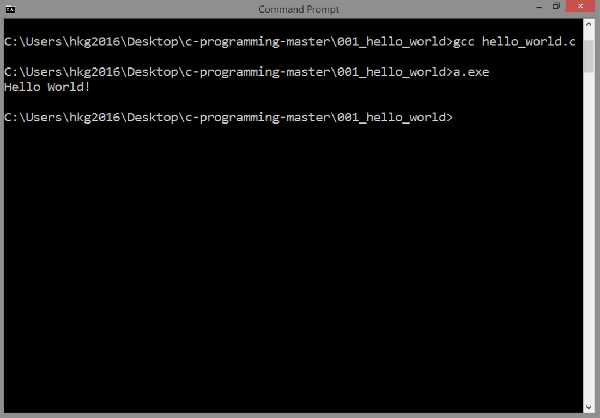

<!-- Global site tag (gtag.js) - Google Analytics -->
<script async src="https://www.googletagmanager.com/gtag/js?id=UA-146817309-1"></script>
<script>
  window.dataLayer = window.dataLayer || [];
  function gtag(){dataLayer.push(arguments);}
  gtag('js', new Date());

  gtag('config', 'UA-146817309-1');
</script>

# INTRODUCTION TO C
## Source Code

```
#include <stdio.h> 

int main()
{

printf("Hello World!\n");

return 0;

}
```

***
## Result


***
## Details
### Including Files
In C, including files are common, just like
in our example:

```	
#include <stdio.h>   
```

It is just like copying the content of another source file 
and pasting it to the other one. Why not just copy and paste
manually? We usually don't do
that, it can cause errors. Hence, the need for 
this command. 

Separating one big source code into small ones is a good practice
in software development. Specific parts can be located easily.
The logic among them can be inferred without much hassle.

***
### The Main Function
This defines a function called `main`:

```
int main()
{

printf("Hello World!\n");

return 0;

}
```

The return type is an `int` (integer)
and it takes no arguments.
The main function is required for all
C programs. It's where execution of the
code begins.
I tend to use spaces to make blocks
of code more readable, you can also
use tabs.

***
### Outputting Results
This line calls a function called `printf`:

```
printf("Hello World!\n");
```

and passes a `Hello World!` string, along
with a special end of line character `\n`.
A semi-colon `;` is required at the end of 
each line. Take note, free-form languages just like C
does not terminate a command by simply pressing
`enter` or `return` to create a newline, it will
still look for the semicolon as the indicator that
a command is ended.

`printf` is actually printing output to `stdout`.
This topic is quite complex for this introduction,
but in basic terms, `printf` is one way to output
something. Much of the
hidden process is happening in the processor.
 
***
### Returning Status
Again, the return type for the main
function is an integer.

```
return 0;
```

Here, we return the 
integer zero, which is the convention 
for signifying that the program exited
normally. You actually don't need to
include this line at all. You might get
a warning from the compiler but the program
will compile and run normally.

***
Next: [DATA TYPES](../002_variable_types/)
