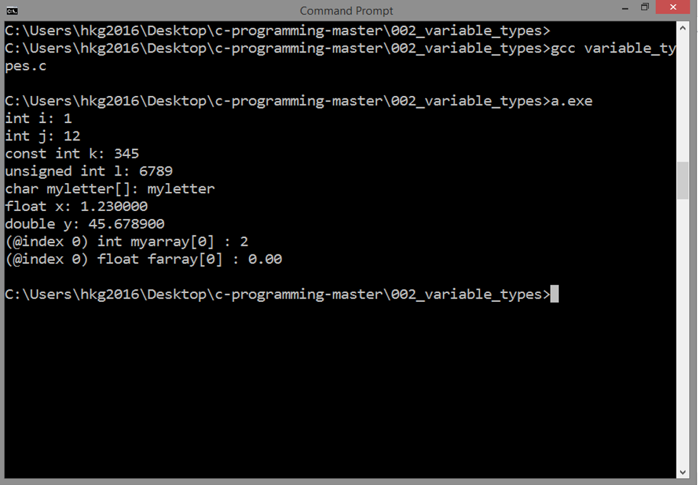

<!-- Global site tag (gtag.js) - Google Analytics -->
<script async src="https://www.googletagmanager.com/gtag/js?id=UA-146817309-1"></script>
<script>
  window.dataLayer = window.dataLayer || [];
  function gtag(){dataLayer.push(arguments);}
  gtag('js', new Date());

  gtag('config', 'UA-146817309-1');
</script>

# DATA TYPES
## Source Code

```
#include <stdio.h>

   int i;
   
   int j = 12;
   const int k = 345;
   unsigned int l = 6789;

   char myletter[] = "myletter";
   float x = 1.23;
   double y = 45.6789;

   int myarray[5] = { 2, 4, 6, 8, 10 };
   float farray[100];

int main()
{

   i = 1;
   printf("int i: %d\n", i);

   printf("int j: %d\n", j);
   printf("const int k: %d\n", k);
   printf("unsigned int l: %d\n", l);

   printf("char myletter[]: %s\n", myletter);
   
   printf("float x: %f\n", x);
   printf("double y: %f\n", y);

   printf("(@index 0) int myarray[0] : %d\n", myarray[0]);
   printf("(@index 0) float farray[0] : %1.2f\n", farray[0]);
   
   return 0;
}
```

***
## Result


***
## Details
### Data Types and Compiler
Data types are very important in a programming language.
In basic terms, they tell how data
should be treated by the compiler.
Other programming languages are just loosely type, but still,
they have data types.

***
Declare an integer: 

	int i;

***
Declare and initialize an integer:
 
	int j = 12;

***
Declare and initialize a constant integer:
	
	const int k = 345;

***
Declare and initialize an unsigned integer:

	unsigned int l = 6789;

***
Declare and initialize a string called "myletter":
	
	char myletter[] = "myletter";

Take note: In C, strings are just one-dimensional 
array of characters.  

***
Declare and initialize a single-precision floating point number:

	float x = 1.23;

***
Declare and initialize a double-precision floating point number:

	double y = 45.6789;

***
Arrays are contiguous in memory and can be
accessed like so: 
	
	myarray[0], myarray[1], ...

Note that the first index is always 0 in C!

***
Declare and initialize a 5-element integer array:
	
	int myarray[5] = { 2, 4, 6, 8, 10 };

***
Declare a 100-element array of single-precision floating point numbers:

	float farray[100];

***
Next: [FLOW CONTROL](../003_flow_control/)
