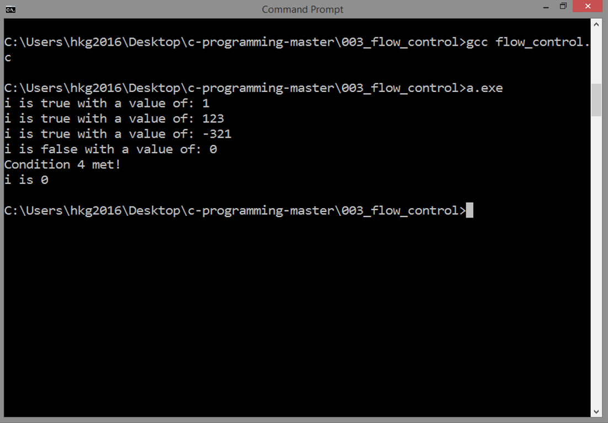

<!-- Global site tag (gtag.js) - Google Analytics -->
<script async src="https://www.googletagmanager.com/gtag/js?id=UA-146817309-1"></script>
<script>
  window.dataLayer = window.dataLayer || [];
  function gtag(){dataLayer.push(arguments);}
  gtag('js', new Date());

  gtag('config', 'UA-146817309-1');
</script>

# FLOW CONTROL
## Source Code

```
#include <stdio.h>

int main()
{

  int i = 1;
  if ( i ) printf("i is true with a value of: %d\n", i);

  i = 123;
  if ( i ) printf("i is true with a value of: %d\n", i);

  i = -321;
  if ( i ) printf("i is true with a value of: %d\n", i);

  i = 0;
  if ( i ) {
     printf("i is true with a value of: %d\n", i);
  }
  else {
     printf("i is false with a value of: %d\n", i);
  }

  int y = 26;
  if ( i > 0 && y == 26 ) {
     printf("Condition 1 met!\n");
  }
  else if ( i > 0 || y == 25 ) {
     printf("Condition 2 met!\n");
  }
  else if ( i != 0 ) {
     printf("Condition 3 met!\n");
  }
  else if ( !i && y >= 20 ) {
     printf("Condition 4 met!\n");
  }
  else if ( i == 0 ) {
     printf("Condition 5 met!\n");
  }
  else {
     printf("no condition met!\n");
  }

  if ( y == 26 ) {
     if ( i != 0 ) {
        printf("i is not 0!\n");
     }
     else {
        printf("i is 0\n");
     }
  }

  return 0;

}
```

***
## Result


***
## Details
### True? False?	
We stick first to conditional statements,
because this can alter the execution
of the program by making decisions
and skipping some parts of the code.   

Native `Boolean` data type does not exist in C.
Integer is used instead, with a 
value of zero evaluated as `FALSE` and a non-zero
value evaluated as `TRUE`.

***
This will resut to `TRUE` because `i` is `TRUE`
with a value of 1:

```
  int i = 1;
  if ( i ) printf("i is true with a value of: %d\n", i);
```

***
This will result to `TRUE` because `i` is `TRUE`:
it is not zero, it is 123. 

```
  i = 123;
  if ( i ) printf("i is true with a value of: %d\n", i);
```

***
This will still result to `TRUE` because `i` is
still `TRUE`: it is not zero, it is -321.
 
```  
  i = -321;
  if ( i ) printf("i is true with a value of: %d\n", i);
```

***
This will result to `FALSE` because `i` is now zero.

```
  i = 0;
  if ( i ) {
     printf("i is true with a value of: %d\n", i);
  }
  else {
     printf("i is false with a value of: %d\n", i);
  }
```

***
### if-else 
Note that in a large `if-else` block like the one
below, program flow jumps out of the block after
the first match is found. Its contents are 
executed, then this `if-else` block is done. 

```
  int y = 26;
  if ( i > 0 && y == 26 ) {
     printf("Condition 1 met!\n");
  }
  else if ( i > 0 || y == 25 ) {
     printf("Condition 2 met!\n");
  }
  else if ( i != 0 ) {
     printf("Condition 3 met!\n");
  }
  else if ( !i && y >= 20 ) {
     printf("Condition 4 met!\n");
  }
  else if ( i == 0 ) {
     printf("Condition 5 met!\n");
  }
  else {
     printf("no condition met!\n");
  }
```

In our case here, `Condition 4` is the first
match, even if `Condition 5` is also true,
it will not continue
seeking for the other matches.
This is why `Condition 5 is met!` is not
printed.

***
### Nesting Multiple if and if-else Statements
Nested `if` and `if-else` blocks are also allowed:

```
  if ( y == 26 ) {
     if ( i != 0 ) {
        printf("i is not 0!\n");
     }
     else {
        printf("i is 0\n");
     }
  }
```

As we see here, there are two `if` conditions,
so the program flow will be like:

Is it really true that `y` is equal to 26?
If yes, proceed to the second `if`.
If not, this `if` block is done, cancel
everything inside this block, including
the `if-else`.

In our case here, `y` is really equal to 26,
so it goes down to the second `if`
that tests whether `i` is not equal to zero,
but according to the last value of `i`,
it is zero, so it will execute
the `else` block, so it prints `i is 0`.

***
After this, you can now easily grasp the idea
of loops, where it automates things for you.

***
Next: [LOOPS](../004_loops/)
