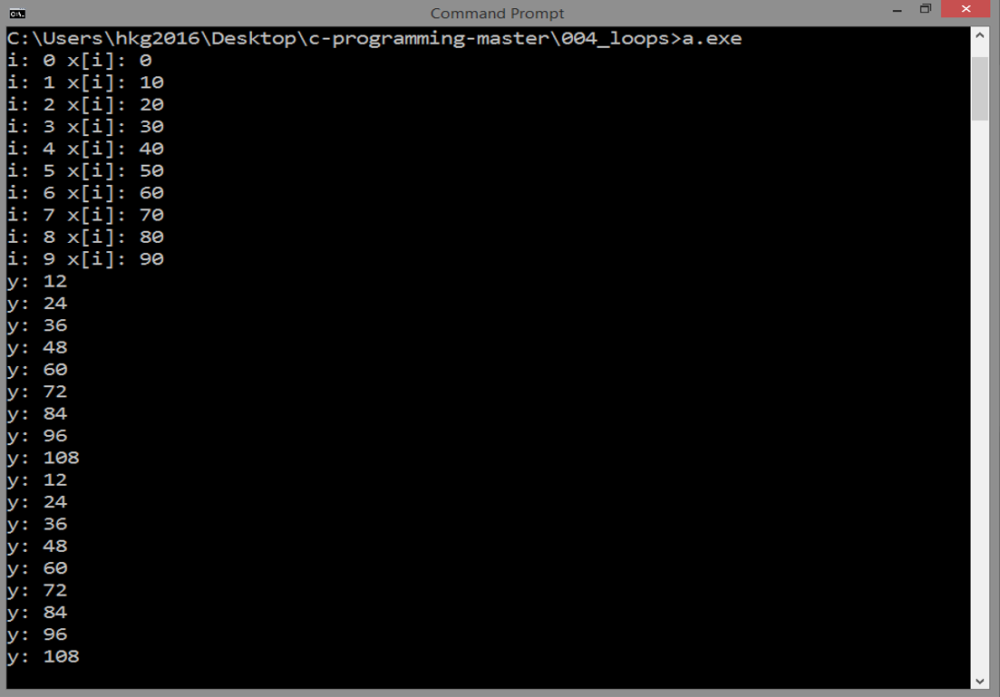

<!-- Global site tag (gtag.js) - Google Analytics -->
<script async src="https://www.googletagmanager.com/gtag/js?id=UA-146817309-1"></script>
<script>
  window.dataLayer = window.dataLayer || [];
  function gtag(){dataLayer.push(arguments);}
  gtag('js', new Date());

  gtag('config', 'UA-146817309-1');
</script>

# LOOPS
## Source Code

```
#include <stdio.h>

int main()
{
   
   int n = 10;

   int i;
   int x[n];
   for ( i=0; i<n ; i++ ) {
      x[i] = i * 10;
      printf("i: %d x[i]: %d\n",i,x[i]);
   }
  
   int y = 0;
   while ( y < 100 ) {
      y += 12;
      printf("y: %d\n",y);
   }

   y = 0;
   do {
      y += 12;
      printf("y: %d\n",y);
   }
   while ( y < 100 );

   return 0;

}
```

***
## Result


***
## Details
### for Loop
We will use `i` as an index within `for` loop:

```
  int i;
   int x[n];
   for ( i=0; i<n ; i++ ) {
      x[i] = i * 10;
      printf("i: %d x[i]: %d\n",i,x[i]);
   }
```

Here, `i` will start at 0. Then, it will test whether
`i` is less than `n` which is 10. If this test evaluates to true,
it will execute the commands. That range will be from 0 to 9.
Then, when the value of `i` is 10,
it stops looping because 
`i < n` evaluates to false. Then, this `for` loop is done.

***
### while Loop
`while` loop is useful in certain situations as well:

```
   int y = 0;
   while ( y < 100 ) {
      y += 12;
      printf("y: %d\n",y);
   }
```

In `while` loop, it will first test the condition.
If the condition evaluates to false, it will be skipped,
so, `while` loop 
may not execute the commands at all.

But in the example here, `while` loop succeeded. 

***
### do-while Loop
`do-while` loop is used instead of `while` loop
if you want the code block executed before evaluation
of a condition, *at least once*.

```
   y = 0;
   do {
      y += 12;
      printf("y: %d\n",y);
   }
   while ( y < 100 );   
```

***
Now, here is the tricky part: in our example,
you will notice that both
`do-while` and `while` loops ended at 
the value of 108, but the problem
is that, in the given condition, `y` should be 
less than 100 to continue looping
or else it should stop looping. Then why these loops ended at 108?

***
Next: [POINTERS](../005_pointers)
