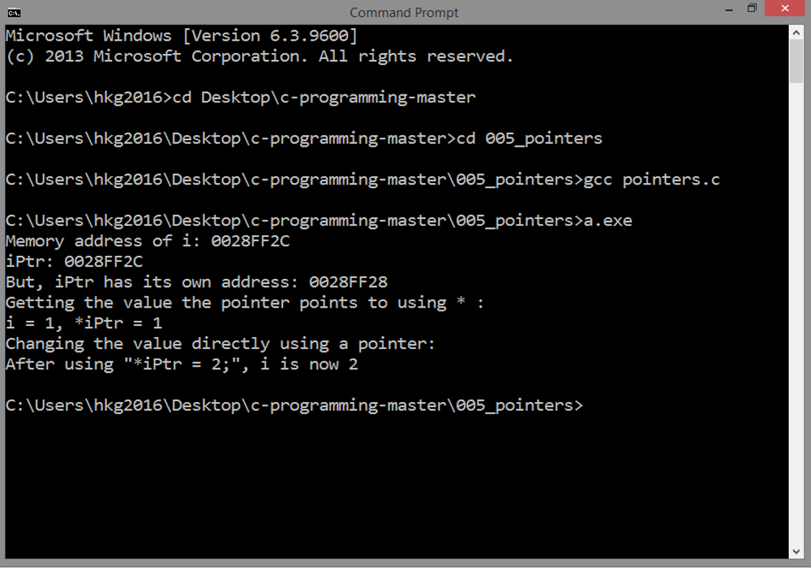

<!-- Global site tag (gtag.js) - Google Analytics -->
<script async src="https://www.googletagmanager.com/gtag/js?id=UA-146817309-1"></script>
<script>
  window.dataLayer = window.dataLayer || [];
  function gtag(){dataLayer.push(arguments);}
  gtag('js', new Date());

  gtag('config', 'UA-146817309-1');
</script>

# POINTERS
## Source Code

```
#include <stdio.h>

int main()
{

  int i = 1; 

  int *iPtr;
  iPtr = &i;

  printf("Memory address of i: %p\n", &i);
  printf("iPtr: %p\n", iPtr);
  printf("But, iPtr has its own address: %p\n", &iPtr);
  
  printf("Getting the value the pointer points to using * :\n");
  printf("i = %d, *iPtr = %d\n", i, *iPtr);
  printf("Changing the value directly using a pointer:\n"); 
  *iPtr = 2;
  printf("After using \"*iPtr = 2;\", i is now %d\n", i);

  return 0;

}
```

***
## Result


***
## Details
### Pointers
A normal integer is declared like the one below.
This assigns a piece of memory for `i`,
and stores the value 1 in this memory.

```  
  int i = 1;
``` 

On the other hand, pointers were introduced as a way to 
access a memory location directly and
the value stored there.

Declare a pointer with the `*` character:

```
  int *iPtr;
```

A pointer is a variable that contains memory address. But that
pointer has its own memory address too.

```
  printf("Memory address of i: %p\n", &i);
  printf("iPtr: %p\n", iPtr);
  printf("But, iPtr has its own address: %p\n", &iPtr);
```  

***
#### Referencing and Dereferencing
You can **reference** a variable's memory using the `&` symbol.
Then, after getting that memory address, you can store it in 
a pointer variable, in our case here, it is `iPtr`.

```
  iPtr = &i;
```

You can also access the value in memory that a 
pointer is pointing to using the `*` symbol,
in our case here, `*iPtr`. This
is called **dereferencing**.

```
  printf("i: %d, *iPtr: %d\n", i, *iPtr);
```

***
There are several benefits of using pointers, one
is passing function arguments by reference, which
is illustrated in the `functions.c` example. 

With pointers, you have the ability to alter directly the value
stored in a memory location:

```
  *iPtr = 2;
  printf("After using \"*iPtr = 2;\", i is now %d\n", i);
```

***
Next: [FUNCTIONS](../006_functions)
