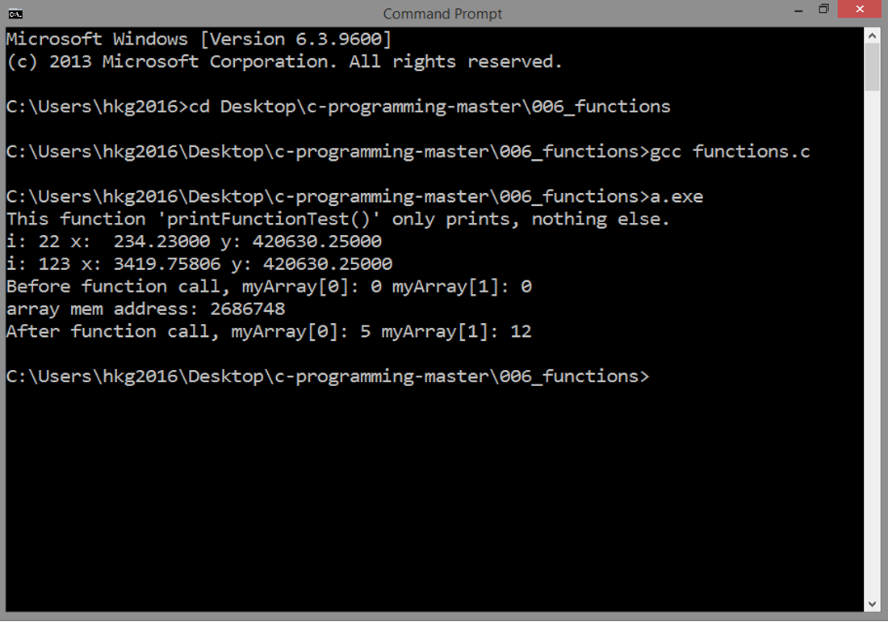

<!-- Global site tag (gtag.js) - Google Analytics -->
<script async src="https://www.googletagmanager.com/gtag/js?id=UA-146817309-1"></script>
<script>
  window.dataLayer = window.dataLayer || [];
  function gtag(){dataLayer.push(arguments);}
  gtag('js', new Date());

  gtag('config', 'UA-146817309-1');
</script>

# FUNCTIONS
## Source Code

```
#include <stdio.h>

void printFunctionTest()
{ 
   printf("This function 'printFunctionTest()' only prints, nothing else.\n");
}

float mySimpleFuncByValue(int iloc, float xloc)
{

   iloc += 101;
   xloc *= 14.6;

   float yloc = (float)iloc * xloc;
   
   return yloc;   

}

float mySimpleFuncByReference(int *iPtr, float *xPtr)
{

   *iPtr += 101;
   *xPtr *= 14.6;

   int iloc = *iPtr;
   float xloc = *xPtr;

   float yloc = (float)iloc * xloc;
   
   return yloc;   

}

void modifyArray( int *array )
{

   array[0] = 5;
   array[1] = 12;

}


int main()
{

   printFunctionTest();
      
   int i = 22;
   float x = 234.23;

   float y = mySimpleFuncByValue(i, x);
   printf("i: %d x: %10.5f y: %10.5f\n", i, x, y);   

   y = mySimpleFuncByReference(&i, &x);
   printf("i: %d x: %10.5f y: %10.5f\n", i, x, y);   
	
   int myArray[2] = { 0, 0 };
   printf("Before function call, myArray[0]: %d myArray[1]: %d\n", myArray[0], myArray[1]);
   
   printf("array mem address: %d\n", myArray);
   modifyArray(myArray);
   printf("After function call, myArray[0]: %d myArray[1]: %d\n", myArray[0], myArray[1]);

   return 0;

}
```

***
## Result


***
## Details
### Void Function
A declaration of a void function:
```
void printFunctionTest()
{ 
   printf("This function 'printFunctionTest()' only prints, nothing else.\n");
}
```

A void function does not return any value.
A void function will just do the commands inside this block.

When a function is invoked, you think of the 
computer finding the declaration of that function,
then, when found, will execute everything inside
that function.

In our case here, when `printFunctionTest()` function is called
in main function, the computer is tasked to look
for the declaration of this function. It was declared then defined,
so when the computer finds it, will execute everything in
that function.

There are instances that the computer is instructed to look outside 
a source code, maybe in another external library
with the `include` command. As was mentioned,
this is a good practice in software development.

***
### Function with Arguments and Return Values
Parameters will enable you to pass variables
of the same type or even pointers, to be processed inside that
function. Why not just directly do that inside a 
function? One main reason is reusability. Other
variables of the same type can be passed to
these functions instantly when needed.

#### Parameters? Arguments?
First of all, we need to distinguish the two for you not to
be confused.

When declaring a function,
the term is **parameter**.

When passing variables or pointers
to a parameter, the term is
**argument**.

So, you say: "I want to declare a function with two
parameters of integer type, then in main function,
I will insert `x` and `y` variables as arguments."

#### Return Value
Suppose you need to
calculate the distance travelled from the input
of the distance sensor and you want to get that distance value,
a void function cannot do that. You need to declare a function
with a data type and a return value.

The keyword is `return`. This command tells the compiler
to terminate the current function with or without
a return value, or pause as this
current function will call another function. `return` can be used
in void functions also when needed.

A declaration of a function
with parameters `int iloc`, `float xloc`
and a return value named `yloc`.

```
float mySimpleFuncByValue(int iloc, float xloc)
{

   iloc += 101;
   xloc *= 14.6;

   float yloc = (float)iloc * xloc;
   
   return yloc;   

}
```

Take note, inside this function,
`int iloc` and `float xloc` are local variables,
so, these variables cannot be
called outside this function. Also, do not be 
confused of the `*` in `iloc * xloc`:
it's a multiplication operator in this context.

#### Type Casting

```
float yloc = (float)iloc * xloc
```

At this line, since `iloc` is an integer
and `yloc` is a float, we need to **cast**
`iloc` so the compiler will not return an error.
`(float)iloc` command will cast `iloc` integer type to float.

Now, in main function, 
`i` and `x` are both passed by value,
meaning a copy of each of these variables
is passed to `mySimpleFuncByValue(int iloc, float xloc)`.
So, any changes made in 
this function will not reflect
outside this function.

```
   int i = 22;
   float x = 234.23;

   float y = mySimpleFuncByValue(i, x);
   printf("i: %d x: %10.5f y: %10.5f\n", i, x, y);
```

***
### Function with Pointers as Parameters
Another declaration of a function
with pointers as the parameters:
`int *iPtr`, `float *xPtr`.

```
float mySimpleFuncByReference(int *iPtr, float *xPtr)
{

   *iPtr += 101;
   *xPtr *= 14.6;

   int iloc = *iPtr;
   float xloc = *xPtr;

   float yloc = (float)iloc * xloc;
   
   return yloc;   

}
```

Here, we want to dereference 
the pointer and modify the value it points to:
`*iPtr += 101`,
`*xPtr *= 14.6`.

Changes made inside
this function will now affect `i` and `x` after
this function terminates. That's the reason why,
when you call the second `print` command,

```
   printf("i: %d x: %10.5f y: %10.5f\n", i, x, y);
```

`i` now contains the value of 123 and `x` contains
3419.75806.

Now, in main function,
memory addresses can be inserted as an argument
for this function, like this:  

```
mySimpleFuncByReference(&i, &x)
```

That is the essence of
parameter/s of pointer type. You can easily manage
variables and their contents.

#### Passing Pointer for Arrays
Another instance of passing pointers to function is
as follows:

```
void modifyArray( int *array )
{

   array[0] = 5;
   array[1] = 12;

}
```

This function can modify an array whenever this is called,
`int *array` is the parameter. Take note, the parameter
is of pointer type again.
Now, in main function,
we just declare `myArray[2]`. This will be modified
by this function.

When you just call an array without a specific
index, the compiler will return the
memory address of this array. By declaring
a pointer as a parameter in this function, we can
insert a memory address as an argument.
You can even access and manipulate every element 
using only the memory address of an array.

```
   int myArray[2] = { 0, 0 };
   printf("Before function call, myArray[0]: %d myArray[1]: %d\n", myArray[0], myArray[1]);
   modifyArray(myArray);   
   printf("After function call, myArray[0]: %d myArray[1]: %d\n", myArray[0], myArray[1]);
``` 

So, pointers are truly essential to be an excellent C programmer.

***
Next: [STRUCTURE IN C](../007_structures)
