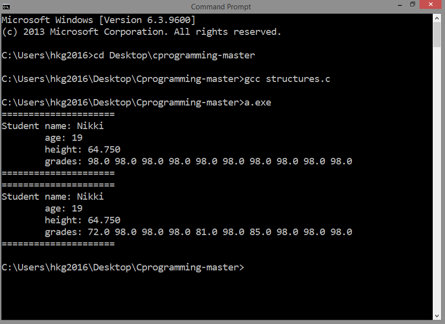

<!-- Global site tag (gtag.js) - Google Analytics -->
<script async src="https://www.googletagmanager.com/gtag/js?id=UA-146817309-1"></script>
<script>
  window.dataLayer = window.dataLayer || [];
  function gtag(){dataLayer.push(arguments);}
  gtag('js', new Date());

  gtag('config', 'UA-146817309-1');
</script>

# STRUCTURE IN C
## Source Code

```
#include <stdio.h>

typedef struct
{
   char *name;
   int age;
   float height;
   float grades[10];
} student;

void printStruct( student oneStudent )
{
   int i;

   printf("=====================\n");
   printf("Student name: %s\n", oneStudent.name);
   printf("        age: %d\n", oneStudent.age);
   printf("        height: %6.3f\n", oneStudent.height);
   printf("        grades: ");
   for (i=0; i<10; i++) printf("%4.1f ", oneStudent.grades[i]);
   printf("\n");
   printf("=====================\n");

}

void modifyStruct( student *oneStudent )
{
 
   oneStudent->grades[0] = 72.0;
   oneStudent->grades[4] = 81.0;
   oneStudent->grades[6] = 85.0;

}

int main()
{

   student Nikki;
   Nikki.name = "Nikki";
   Nikki.age = 19;
   Nikki.height = 64.75;
   int i;
   for (i=0; i<10; i++) {
      Nikki.grades[i] = 98.0;
   }

   printStruct(Nikki);

   modifyStruct(&Nikki);

   printStruct(Nikki);

   return 0;
}
```

***
## Result



***

## Details
### Structure Data Type
This is an example of 
a structure in C:

```
typedef struct
{
   char *name;
   int age;
   float height;
   float grades[10];
} student;
```

where `int age` is in years,
`float height` in inches
and `float grades[10]` are the grades 
for the 10 assignments.

Structure is a user-defined 
data type in C. It is really needed to
mix different data types in one declaration.

#### typedef 
`typedef` is a keyword which will enable
you to give an existing type a new name. 
In our case here, it is just like saying:
"Let us define this structure by 
calling `student`."

#### Structure Variable
`student` is a structure
variable that can access the members of
this structure.

#### Member Access Operator
In order to access a member of an
structure we use `.` symbol, just like
`oneStudent.name`.
 
***
A function to print the details:

```
void printStruct( student oneStudent )
{
   int i;

   printf("=====================\n");
   printf("Student name: %s\n", oneStudent.name);
   printf("        age: %d\n", oneStudent.age);
   printf("        height: %6.3f\n", oneStudent.height);
   printf("        grades: ");
   for (i=0; i<10; i++) printf("%4.1f ", oneStudent.grades[i]);
   printf("\n");
   printf("=====================\n");

}
```

Take note of this parameter: `student oneStudent`.
`oneStudent` is a variable of type `student`.
That is the type we defined in the structure.

Again, you might be overwhelmed by the `printf` function that
contains strange things like this: `%6.3f`.
Don't worry, they are just formatting commands like
whether how many decimal places should be there, or 
you want to pad those numbers with zero.

In the case of `%6.3f`, it means, format the floating 
type number 6 digit wide, 3 decimal places.

***
A function to modify the structure:

```
void modifyStruct( student *oneStudent )
{
   
   oneStudent->grades[0] = 72.0;
   oneStudent->grades[4] = 81.0;
   oneStudent->grades[6] = 85.0;

}
```

In order to modify the declared structure, 
we still use pointer as parameter
to accept a memory location as argument:
that is, to easily locate it and
modify everything using the index of each
data member.

Pointers to structs have special `->` symbol
for dereferencing the pointer and accessing a 
data member.

And what does it do?
`oneStudent->grades[0] = 72.0` is equivalent to
`(*oneStudent).grades[0] = 72.0`.

***
In main function, `student`
data type is used: `student Nikki`
is just like any other variable
declaration, like `int myInteger`.
Coming from the structure we defined,
we can put data in `student Nikki`.

```
   student Nikki;
   Nikki.name = "Nikki";
   Nikki.age = 19;
   Nikki.height = 64.75;
   int i;
   for (i=0; i<10 ; i++) {
      Nikki.grades[i] = 98.0;
   }
```

The functions we created, we call them in main function
to act upon the structure:

```
   printStruct(Nikki);

   modifyStruct(&Nikki);

   printStruct(Nikki);
```

We first check whether `Nikki` was successfully created by
calling the command `printStruct(Nikki)`. 
Then, we modify the initial contents of this structure
by calling the command `modifyStruct(&Nikki)`. Remember that placing `&`
before a variable will return the address of that variable.
And finally, we check again whether the changes were
saved by calling the command `printStruct(Nikki)`.
 
***
There are confusing terms that you might be thinking:
data type, database and data structure.

As was demonstrated, a structure in C is there
to mix different data types in one declaration. Every member
can be accessed easily. In general, **data structure** is data that
can be accessed piece by piece. For example, an XML file is
considered semi-structured, for elements can be parsed but from
top to bottom while a database file is a structured data,
for pieces of information can be accessed randomly without parsing
the entire database.

**Data type** is declared to easily tell the compiler
how a particular data should be treated. 

**Database** is an organized
collection of data usually expressed as tables.
It is commonly built upon a filesystem.
Data will persist after the computer is turned off because data
resides on persistent storage.

***
Next:
[COMMAND LINE ARGUMENTS](../008_pass_command_line_options)
