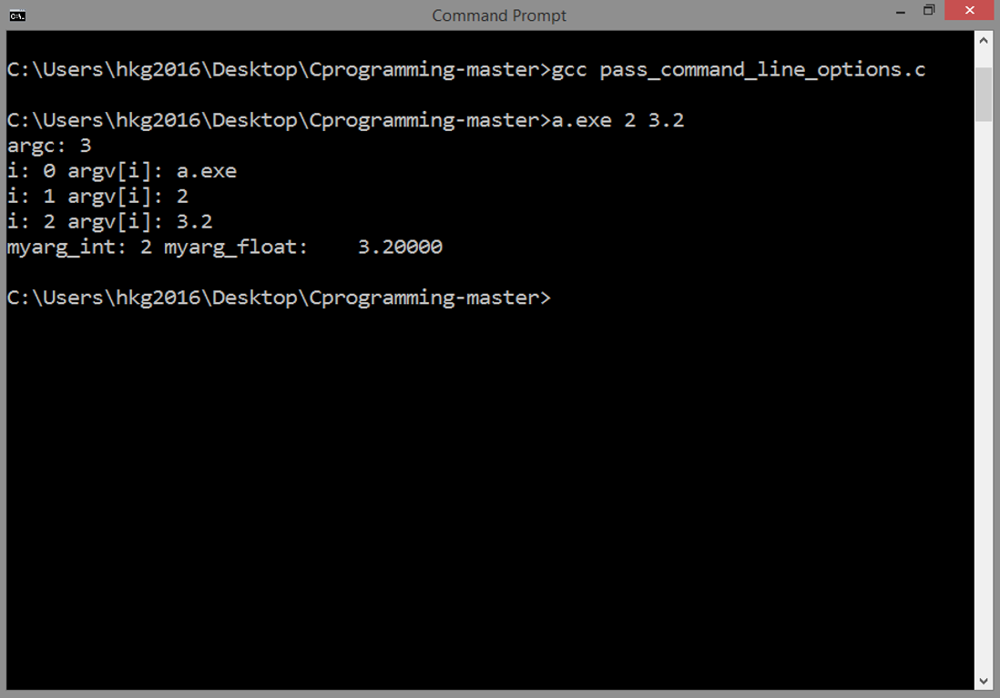
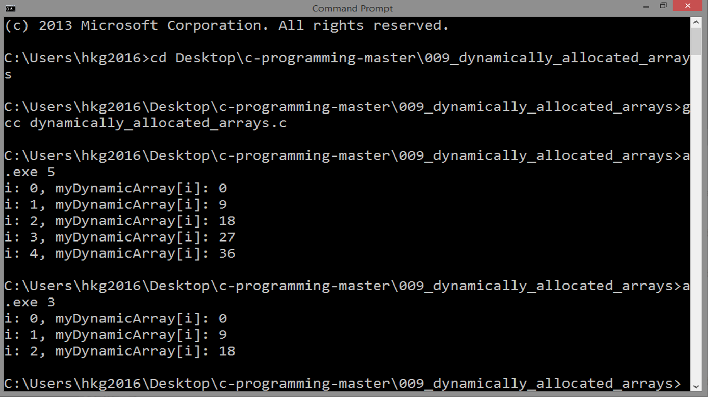
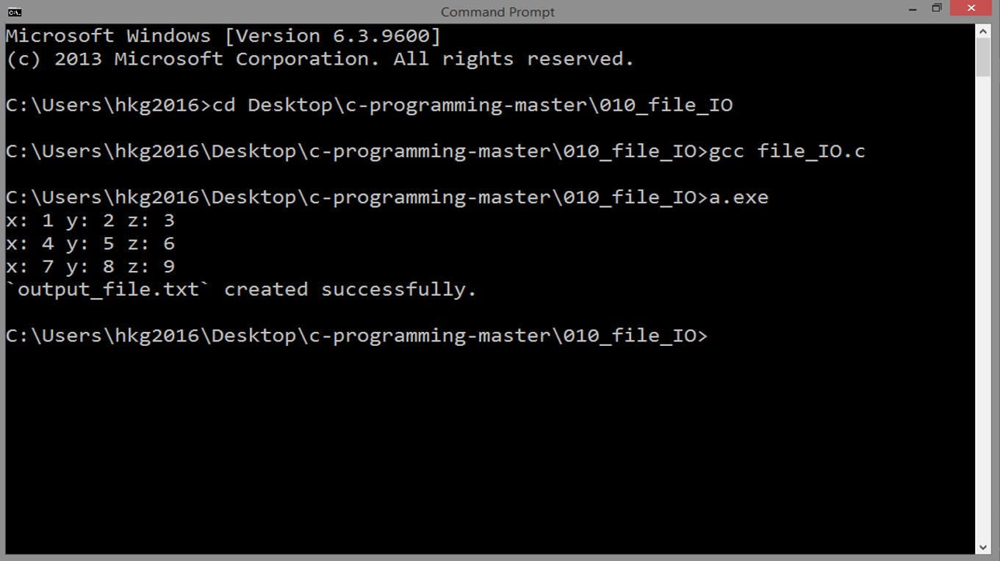

<!-- Global site tag (gtag.js) - Google Analytics -->
<script async src="https://www.googletagmanager.com/gtag/js?id=UA-146817309-1"></script>
<script>
  window.dataLayer = window.dataLayer || [];
  function gtag(){dataLayer.push(arguments);}
  gtag('js', new Date());

  gtag('config', 'UA-146817309-1');
</script>

# C Programming Tutorial

*`updated 21 April 2022`*

[](https://hits.seeyoufarm.com)

TOC
1. [Intro](#intro)
2. [Intro To C](#introduction-to-c)
3. [Data Types](#data-types)
4. [Flow Control](#decision-making)
5. [Loops](#loops)
6. [Pointers](#pointers)
7. [Functions](#functions)
8. [Structures](#structure-in-c)
9. [Command Line Arguments](#command-line-arguments)
10. [Dynamically Allocated Arrays](#dynamic-memory-allocation-using-arrays)
11. [File Input Output](#file-input-output)

## Intro
After this, you can study a good example
how these things are being applied 
in software development:

<https://github.com/xkcph2017x/CalC>

Thanks for visiting! 

We prepared a detailed 
documentation for you. You don't even need to
compile the source codes because there are screenshots
of the results!

Much more, we are willing to collaborate and communicate!
This is all about learning C, so we might not be
able to put every information, but we are willing
to answer your queries.

The source codes that were mentioned 
in this tutorial can be downloaded from 
this repository:

<https://github.com/xdvrx1/C-Language-Tutorial>

or by clicking the `View on GitHub` button.

Also, in order for you to truly collaborate,
you need a GitHub account and you need
to be at GitHub too.
There, you can
fork this repository, make some changes
then create a pull request 
and many more features.
It's quite strange at first but this is the best way to
develop a software as one team. Furthermore, GitHub can
be used for blogging and can be a collaborative tool for
non-code projects!
Also, this can be your portfolio as software developer,
so why not start exploring now. It's worth it. This is the link:

<https://github.com/join>

Although not all the topics here were covered,
but you can easily
grasp the idea because of this tutorial. 
Enjoy life full of coding projects!

### Why C language?
It's very important to understand why C language
is there and why it is not obsolete, as others 
believe. 

C was created on the premise that it
would be the tool to make utilities of the 
existing Unix. And later, Unix was 
rewritten using C.
But before C, there were problems that could not be
addressed by existing languages back then, such as:

- simplifying the existing
assembly languages to write programs but should be
almost of the same speed as them

- each assembler basically responds to a particular 
machine architecture

- existing languages such as COBOL, FORTRAN 
and BASIC were not meant to be for structured
programming

When C was introduced, it was the programming language
that answered these problems.
And then, there came a time, programs were complex
enough that *structured programming* would not suffice.
So, *object-oriented programming* (OOP) came into existence through
several programming languages like C++ and Java.
But remember, C is still the one for system
programming, say, creating
a programming language, an operating system,
and the like.

And since C language upgraded the world of
computer programming, its influence can be felt
in almost all programming languages after C.
Hence, it
will greatly help those who are still learning
computer programming in general, as
learning C will provide a solid background
because most of the programming languages
adopted concepts from it.

### Building and Running Executables
When using MinGW in Windows OS,
in the Command Prompt,
change the directory to where you put 
your source codes, say, on the Desktop.

And using `hello_world.c` as an example, type:

	gcc hello_world.c
		
hit `Enter`, then type:

	a.exe		
		
You will see the output in your console.

When you want a unique name for your executable,
type:

	gcc -o hello_world.exe hello_world.c
		
hit `Enter`, then type:

	hello_world.exe

### Using GNU Make
Make sure that GNU Make is installed in your computer.
Windows OS does not have this tool by default. So,
visit this site for more information, including how
to install it in Windows OS:

<http://gnuwin32.sourceforge.net/packages/make.htm>

GNU Make is a build tool that can run
commands automatically. It is used in large
projects, so programmers would not end up manually updating
every file that catches a lot of errors.

Here, we want to use Make as part of the demonstration,
to prepare you using this build tool.

First, you open the Command Prompt.
Change the directory to where you put your codes.
Then,

- to build all executables, type:

		make 

- to build a specific executable, type:

		make name_of_c_program

- to delete all executables, type:

		make clean

When you tell the Command Prompt to execute
the command `make`, it actually executes the 
contents of the `Makefile`. So, the computer and 
this tool will automate things for you, particularly,
in large projects to avoid errors and build
the software with ease.

### Windows OS
In Windows OS, it is best to use MinGW C compiler.
Please refer to <http://www.mingw.org/> for
full documentation.

### Compiler
Compiler is a software that takes the job
of translating source codes into machine language,
one way or the other.

An assembly language, even though low-level,
will still be needing an assembler to translate
everything into an instruction the machine can understand.
So, every source code will always
be translated to machine language. But, it is not
up to us, humans, to do the translation manually.
That is the reason why writing compilers takes a lot
of skills and intellect. 

Technology companies usually offer their own compilers.
They created them
according to their own designs, 
to satisfy their needs or maybe to topple every business competitor.

### License
ACCRE licensed this repo under MIT. 

xdvrx1 included that license and
the changes he made were also licensed under MIT.


## Introduction To C
### Source Code
```
#include <stdio.h> 

int main()
{

printf("Hello World!\n");

return 0;

}
```
### Result
```
Hello World!
```

### Details
#### Including Files
In C, including files are common, just like
in our example:

```	
#include <stdio.h>   
```

It is just like copying the content of another source file 
and pasting it to the other one. Why not just copy and paste
manually? We usually don't do
that, it can cause errors. Hence, the need for 
this command. 

Separating one big source code into small ones is a good practice
in software development. Specific parts can be located easily.
The logic among them can be inferred without much hassle.

#### The Main Function
This defines a function called `main`:

```
int main()
{

printf("Hello World!\n");

return 0;

}
```

The return type is an `int` (integer)
and it takes no arguments.
The main function is required for all
C programs. It's where execution of the
code begins.
I tend to use spaces to make blocks
of code more readable, you can also
use tabs.

#### Outputting Results
This line calls a function called `printf`:

```
printf("Hello World!\n");
```

and passes a "Hello World!" string, along
with a special end of line character `\n`.
A semi-colon `;` is required at the end of 
each line. Take note, free-form languages just like C
does not terminate a command by simply pressing
`enter` or `return` to create a newline, it will
still look for the semicolon as the indicator that
a command is ended.

`printf` is actually printing output to `stdout`.
This topic is quite complex for this introduction,
but in basic terms, `printf` is one way to output
something. Much of the
hidden process is happening in the processor.
 
#### Returning Status
Again, the return type for the main
function is an integer.

```
return 0;
```

Here, we return the 
integer zero, which is the convention 
for signifying that the program exited
normally. You actually don't need to
include this line at all. You might get
a warning from the compiler but the program
will compile and run normally.

## Data Types
### Source Code
```
#include <stdio.h>

   int i;
   
   int j = 12;
   const int k = 345;
   unsigned int l = 6789;

   char myletter[] = "myletter";
   float x = 1.23;
   double y = 45.6789;

   int myarray[5] = { 2, 4, 6, 8, 10 };
   float farray[100];

int main()
{

   i = 1;
   printf("int i: %d\n", i);

   printf("int j: %d\n", j);
   printf("const int k: %d\n", k);
   printf("unsigned int l: %d\n", l);

   printf("char myletter[]: %s\n", myletter);
   
   printf("float x: %f\n", x);
   printf("double y: %f\n", y);

   printf("(@index 0) int myarray[0] : %d\n", myarray[0]);
   printf("(@index 0) float farray[0] : %1.2f\n", farray[0]);
   
   return 0;
}
```

### Result
```
int i: 1
int j: 12
const int k: 345
unsigned int l: 6789
char myletter[]: myletter
float x: 1.230000
double y: 45.678900
(@index 0) int myarray[0] : 2
(@index 0) float farray[0] : 0.00
```

### Details
#### Data Types and Compiler
Data types are very important in a programming language.
In basic terms, they tell how data
should be treated by the compiler.
Other programming languages are just loosely type, but still,
they have data types.

***
Declare an integer: 

	int i;

***
Declare and initialize an integer:
 
	int j = 12;

***
Declare and initialize a constant integer:
	
	const int k = 345;

***
Declare and initialize an unsigned integer:

	unsigned int l = 6789;

***
Declare and initialize a string called "myletter":
	
	char myletter[] = "myletter";

Take note: In C, strings are just one-dimensional 
array of characters.  

***
Declare and initialize a single-precision floating point number:

	float x = 1.23;

***
Declare and initialize a double-precision floating point number:

	double y = 45.6789;

***
Arrays are contiguous in memory and can be
accessed like so: 
	
	myarray[0], myarray[1], ...

Note that the first index is always 0 in C!

***
Declare and initialize a 5-element integer array:
	
	int myarray[5] = { 2, 4, 6, 8, 10 };

***
Declare a 100-element array of single-precision floating point numbers:

	float farray[100];
	
## Decision Making
### Source Code
```
#include <stdio.h>

int main()
{

  int i = 1;
  if ( i ) printf("i is true with a value of: %d\n", i);

  i = 123;
  if ( i ) printf("i is true with a value of: %d\n", i);

  i = -321;
  if ( i ) printf("i is true with a value of: %d\n", i);

  i = 0;
  if ( i ) {
     printf("i is true with a value of: %d\n", i);
  }
  else {
     printf("i is false with a value of: %d\n", i);
  }

  int y = 26;
  if ( i > 0 && y == 26 ) {
     printf("Condition 1 met!\n");
  }
  else if ( i > 0 || y == 25 ) {
     printf("Condition 2 met!\n");
  }
  else if ( i != 0 ) {
     printf("Condition 3 met!\n");
  }
  else if ( !i && y >= 20 ) {
     printf("Condition 4 met!\n");
  }
  else if ( i == 0 ) {
     printf("Condition 5 met!\n");
  }
  else {
     printf("no condition met!\n");
  }

  if ( y == 26 ) {
     if ( i != 0 ) {
        printf("i is not 0!\n");
     }
     else {
        printf("i is 0\n");
     }
  }

  return 0;

}
```

### Result
```
i is true with a value of: 1
i is true with a value of: 123
i is true with a value of: -321
i is false with a value of: 0
Condition 4 met!
i is 0
```

### Details
#### True? False?	
We stick first to conditional statements,
because this can alter the execution
of the program by making decisions
and skipping some parts of the code.   

Native `Boolean` data type does not exist in C.
Integer is used instead, with a 
value of zero evaluated as `FALSE` and a non-zero
value evaluated as `TRUE`.

***
This will resut to `TRUE` because `i` is `TRUE`
with a value of 1:

```
  int i = 1;
  if ( i ) printf("i is true with a value of: %d\n", i);
```

***
This will result to `TRUE` because `i` is `TRUE`:
it is not zero, it is 123. 

```
  i = 123;
  if ( i ) printf("i is true with a value of: %d\n", i);
```

***
This will still result to `TRUE` because `i` is
still `TRUE`: it is not zero, it is -321.
 
```  
  i = -321;
  if ( i ) printf("i is true with a value of: %d\n", i);
```

***
This will result to `FALSE` because `i` is now zero.

```
  i = 0;
  if ( i ) {
     printf("i is true with a value of: %d\n", i);
  }
  else {
     printf("i is false with a value of: %d\n", i);
  }
```

#### if-else 
Note that in a large `if-else` block like the one
below, program flow jumps out of the block after
the first match is found. Its contents are 
executed, then this `if-else` block is done. 

```
  int y = 26;
  if ( i > 0 && y == 26 ) {
     printf("Condition 1 met!\n");
  }
  else if ( i > 0 || y == 25 ) {
     printf("Condition 2 met!\n");
  }
  else if ( i != 0 ) {
     printf("Condition 3 met!\n");
  }
  else if ( !i && y >= 20 ) {
     printf("Condition 4 met!\n");
  }
  else if ( i == 0 ) {
     printf("Condition 5 met!\n");
  }
  else {
     printf("no condition met!\n");
  }
```

In our case here, `Condition 4` is the first
match, even if `Condition 5` is also true,
it will not continue
seeking for the other matches.
This is why `Condition 5 is met!` is not
printed.

#### Nesting Multiple if and if-else Statements
Nested `if` and `if-else` blocks are also allowed:

```
  if ( y == 26 ) {
     if ( i != 0 ) {
        printf("i is not 0!\n");
     }
     else {
        printf("i is 0\n");
     }
  }
```

As we see here, there are two `if` conditions,
so the program flow will be like:

Is it really true that `y` is equal to 26?
If yes, proceed to the second `if`.
If not, this `if` block is done, cancel
everything inside this block, including
the `if-else`.

In our case here, `y` is really equal to 26,
so it goes down to the second `if`
that tests whether `i` is not equal to zero,
but according to the last value of `i`,
it is zero, so it will execute
the `else` block, so it prints `i is 0`.

After this, you can now easily grasp the idea
of loops, where it automates things for you.	

## Loops
### Source Code
```
#include <stdio.h>

int main()
{
   
   int n = 10;

   int i;
   int x[n];
   for ( i=0; i<n; i++ ) {
      x[i] = i * 10;
      printf("i: %d x[i]: %d\n", i, x[i]);
   }
  
   int y = 0;
   while ( y < 100 ) {
      y += 12;
      printf("y: %d\n", y);
   }

   y = 0;
   do {
      y += 12;
      printf("y: %d\n", y);
   }
   while ( y < 100 );

   return 0;

}
```

### Result
```
i: 0 x[i]: 0
i: 1 x[i]: 10
i: 2 x[i]: 20
i: 3 x[i]: 30
i: 4 x[i]: 40
i: 5 x[i]: 50
i: 6 x[i]: 60
i: 7 x[i]: 70
i: 8 x[i]: 80
i: 9 x[i]: 90
y: 12
y: 24
y: 36
y: 48
y: 60
y: 72
y: 84
y: 96
y: 108
y: 12
y: 24
y: 36
y: 48
y: 60
y: 72
y: 84
y: 96
y: 108
```

### Details
#### for Loop
We will use `i` as an index within `for` loop:

```
  int i;
   int x[n];
   for ( i=0; i<n; i++ ) {
      x[i] = i * 10;
      printf("i: %d x[i]: %d\n", i, x[i]);
   }
```

Here, `i` will start at 0. Then, it will test whether
`i` is less than `n` which is 10. If this test evaluates to true,
it will execute the commands. That range will be from 0 to 9.
Then, when the value of `i` is 10,
it stops looping because 
`i < n` evaluates to false. Then, this `for` loop is done.

***
#### while Loop
`while` loop is useful in certain situations as well:

```
   int y = 0;
   while ( y < 100 ) {
      y += 12;
      printf("y: %d\n", y);
   }
```

In `while` loop, it will first test the condition.
If the condition evaluates to false, it will be skipped,
so, `while` loop 
may not execute the commands at all.

But in the example here, `while` loop succeeded. 

#### do-while Loop
`do-while` loop is used instead of `while` loop
if you want the code block executed before evaluation
of a condition, *at least once*.

```
   y = 0;
   do {
      y += 12;
      printf("y: %d\n", y);
   }
   while ( y < 100 );   
```

***
Now, here is the tricky part: in our example,
you will notice that both
`do-while` and `while` loops ended at 
the value of 108, but the problem
is that, in the given condition, `y` should be 
less than 100 to continue looping
or else it should stop looping. Then why these loops ended at 108?

## Pointers
### Source Code
```
#include <stdio.h>

int main()
{

  int i = 1; 

  int *iPtr;
  iPtr = &i;

  printf("Memory address of i: %p\n", &i);
  printf("iPtr: %p\n", iPtr);
  printf("But, iPtr has its own address: %p\n", &iPtr);
  
  printf("Getting the value the pointer points to using * :\n");
  printf("i = %d, *iPtr = %d\n", i, *iPtr);
  printf("Changing the value directly using a pointer:\n"); 
  *iPtr = 2;
  printf("After using \"*iPtr = 2;\", i is now %d\n", i);

  return 0;

}
```

### Result
```
Memory address of i: 0x7ffce7495e0c
iPtr: 0x7ffce7495e0c
But, iPtr has its own address: 0x7ffce7495e10
Getting the value the pointer points to using * :
i = 1, *iPtr = 1
Changing the value directly using a pointer:
After using "*iPtr = 2;", i is now 2
```

### Details
#### Pointers
A normal integer is declared like the one below.
This assigns a piece of memory for `i`,
and stores the value 1 in this memory.

```  
  int i = 1;
``` 

On the other hand, pointers were introduced as a way to 
access a memory location directly and
the value stored there.

Declare a pointer with the `*` character:

```
  int *iPtr;
```

A pointer is a variable that contains memory address. But that
pointer has its own memory address too.

```
  printf("Memory address of i: %p\n", &i);
  printf("iPtr: %p\n", iPtr);
  printf("But, iPtr has its own address: %p\n", &iPtr);
```  

##### Referencing and Dereferencing
You can **reference** a variable's memory using the `&` symbol.
Then, after getting that memory address, you can store it in 
a pointer variable, in our case here, it is `iPtr`.

```
  iPtr = &i;
```

You can also access the value in memory that a 
pointer is pointing to using the `*` symbol,
in our case here, `*iPtr`. This
is called **dereferencing**.

```
  printf("i: %d, *iPtr: %d\n", i, *iPtr);
```

***
There are several benefits of using pointers, one
is passing function arguments by reference, which
is illustrated in the `functions.c` example. 

With pointers, you have the ability to alter directly the value
stored in a memory location:

```
  *iPtr = 2;
  printf("After using \"*iPtr = 2;\", i is now %d\n", i);
```

## Functions
### Source Code
```
#include <stdio.h>

void printFunctionTest()
{ 
   printf("This function 'printFunctionTest()' only prints, nothing else.\n");
}

float mySimpleFuncByValue(int iloc, float xloc)
{

   iloc += 101;
   xloc *= 14.6;

   float yloc = (float)iloc * xloc;
   
   return yloc;   

}

float mySimpleFuncByReference(int *iPtr, float *xPtr)
{

   *iPtr += 101;
   *xPtr *= 14.6;

   int iloc = *iPtr;
   float xloc = *xPtr;

   float yloc = (float)iloc * xloc;
   
   return yloc;   

}

void modifyArray( int *array )
{

   array[0] = 5;
   array[1] = 12;

}


int main()
{

   printFunctionTest();
      
   int i = 22;
   float x = 234.23;

   float y = mySimpleFuncByValue(i, x);
   printf("i: %d x: %10.5f y: %10.5f\n", i, x, y);   

   y = mySimpleFuncByReference(&i, &x);
   printf("i: %d x: %10.5f y: %10.5f\n", i, x, y);   
	
   int myArray[2] = { 0, 0 };
   printf("Before function call, myArray[0]: %d myArray[1]: %d\n", myArray[0], myArray[1]);
   
   printf("array mem address: %d\n", myArray);
   modifyArray(myArray);
   printf("After function call, myArray[0]: %d myArray[1]: %d\n", myArray[0], myArray[1]);

   return 0;

}
```

***
## Result
```
This function 'printFunctionTest()' only prints, nothing else.
i: 22 x:  234.23000 y: 420630.25000
i: 123 x: 3419.75806 y: 420630.25000
Before function call, myArray[0]: 0 myArray[1]: 0
array mem address: -214060608
After function call, myArray[0]: 5 myArray[1]: 12
```

### Details
#### Void Function
A declaration of a void function:
```
void printFunctionTest()
{ 
   printf("This function 'printFunctionTest()' only prints, nothing else.\n");
}
```

A void function does not return any value.
A void function will just do the commands inside this block.

When a function is invoked, you think of the 
computer finding the declaration of that function,
then, when found, will execute everything inside
that function.

In our case here, when `printFunctionTest()` function is called
in main function, the computer is tasked to look
for the declaration of this function. It was declared then defined,
so when the computer finds it, will execute everything in
that function.

There are instances that the computer is instructed to look outside 
a source code, maybe in another external library
with the `include` command. As was mentioned,
this is a good practice in software development.

#### Function with Arguments and Return Values
Parameters will enable you to pass variables
of the same type or even pointers, to be processed inside that
function. Why not just directly do that inside a 
function? One main reason is reusability. Other
variables of the same type can be passed to
these functions instantly when needed.

##### Parameters? Arguments?
First of all, we need to distinguish the two for you not to
be confused.

When declaring a function,
the term is **parameter**.

When passing variables or pointers
to a parameter, the term is
**argument**.

So, you say: "I want to declare a function with two
parameters of integer type, then in main function,
I will insert `x` and `y` variables as arguments."

##### Return Value
Suppose you need to
calculate the distance travelled from the input
of the distance sensor and you want to get that distance value,
a void function cannot do that. You need to declare a function
with a data type and a return value.

The keyword is `return`. This command tells the compiler
to terminate the current function with or without
a return value, or pause as this
current function will call another function. `return` can be used
in void functions also when needed.

A declaration of a function
with parameters `int iloc`, `float xloc`
and a return value named `yloc`.

```
float mySimpleFuncByValue(int iloc, float xloc)
{

   iloc += 101;
   xloc *= 14.6;

   float yloc = (float)iloc * xloc;
   
   return yloc;   

}
```

Take note, inside this function,
`int iloc` and `float xloc` are local variables,
so, these variables cannot be
called outside this function. Also, do not be 
confused of the `*` in `iloc * xloc`:
it's a multiplication operator in this context.

##### Type Casting
```
float yloc = (float)iloc * xloc
```

At this line, since `iloc` is an integer
and `yloc` is a float, we need to **cast**
`iloc` so the compiler will not return an error.
`(float)iloc` command will cast `iloc` integer type to float.

Now, in main function, 
`i` and `x` are both passed by value,
meaning a copy of each of these variables
is passed to `mySimpleFuncByValue(int iloc, float xloc)`.
So, any changes made in 
this function will not reflect
outside this function.

```
   int i = 22;
   float x = 234.23;

   float y = mySimpleFuncByValue(i, x);
   printf("i: %d x: %10.5f y: %10.5f\n", i, x, y);
```

#### Function with Pointers as Parameters
Another declaration of a function
with pointers as the parameters:
`int *iPtr`, `float *xPtr`.

```
float mySimpleFuncByReference(int *iPtr, float *xPtr)
{

   *iPtr += 101;
   *xPtr *= 14.6;

   int iloc = *iPtr;
   float xloc = *xPtr;

   float yloc = (float)iloc * xloc;
   
   return yloc;   

}
```

Here, we want to dereference 
the pointer and modify the value it points to:
`*iPtr += 101`,
`*xPtr *= 14.6`.

Changes made inside
this function will now affect `i` and `x` after
this function terminates. That's the reason why,
when you call the second `print` command,

```
   printf("i: %d x: %10.5f y: %10.5f\n", i, x, y);
```

`i` now contains the value of 123 and `x` contains
3419.75806.

Now, in main function,
memory addresses can be inserted as an argument
for this function, like this:  

```
mySimpleFuncByReference(&i, &x)
```

That is the essence of
parameter/s of pointer type. You can easily manage
variables and their contents.

##### Passing Pointer for Arrays
Another instance of passing pointers to function is
as follows:

```
void modifyArray( int *array )
{

   array[0] = 5;
   array[1] = 12;

}
```

This function can modify an array whenever this is called,
`int *array` is the parameter. Take note, the parameter
is of pointer type again.
Now, in main function,
we just declare `myArray[2]`. This will be modified
by this function.

When you just call an array without a specific
index, the compiler will return the
memory address of this array. By declaring
a pointer as a parameter in this function, we can
insert a memory address as an argument.
You can even access and manipulate every element 
using only the memory address of an array.

```
   int myArray[2] = { 0, 0 };
   printf("Before function call, myArray[0]: %d myArray[1]: %d\n", myArray[0], myArray[1]);
   modifyArray(myArray);   
   printf("After function call, myArray[0]: %d myArray[1]: %d\n", myArray[0], myArray[1]);
``` 

So, pointers are truly essential to be an excellent C programmer.

## Structure In C
### Source Code
```
#include <stdio.h>

typedef struct
{
   char *name;
   int age;
   float height;
   float grades[10];
} student;

void printStruct( student oneStudent )
{
   int i;

   printf("=====================\n");
   printf("Student name: %s\n", oneStudent.name);
   printf("        age: %d\n", oneStudent.age);
   printf("        height: %6.3f\n", oneStudent.height);
   printf("        grades: ");
   for (i=0; i<10; i++) printf("%4.1f ", oneStudent.grades[i]);
   printf("\n");
   printf("=====================\n");

}

void modifyStruct( student *oneStudent )
{
 
   oneStudent->grades[0] = 72.0;
   oneStudent->grades[4] = 81.0;
   oneStudent->grades[6] = 85.0;

}

int main()
{

   student Nikki;
   Nikki.name = "Nikki";
   Nikki.age = 19;
   Nikki.height = 64.75;
   int i;
   for (i=0; i<10; i++) {
      Nikki.grades[i] = 98.0;
   }

   printStruct(Nikki);

   modifyStruct(&Nikki);

   printStruct(Nikki);

   return 0;
}
```

### Result
```
=====================
Student name: Nikki
        age: 19
        height: 64.750
        grades: 98.0 98.0 98.0 98.0 98.0 98.0 98.0 98.0 98.0 98.0 
=====================
=====================
Student name: Nikki
        age: 19
height: 64.750
        grades: 72.0 98.0 98.0 98.0 81.0 98.0 85.0 98.0 98.0 98.0 
=====================
```

### Details
#### Structure Data Type
This is an example of 
a structure in C:

```
typedef struct
{
   char *name;
   int age;
   float height;
   float grades[10];
} student;
```

where `int age` is in years,
`float height` in inches
and `float grades[10]` are the grades 
for the 10 assignments.

Structure is a user-defined 
data type in C. It is really needed to
mix different data types in one declaration.

##### typedef 
`typedef` is a keyword which will enable
you to give an existing type a new name. 
In our case here, it is just like saying:
"Let us define this structure by 
calling `student`."

##### Structure Variable
`student` is a structure
variable that can access the members of
this structure.

##### Member Access Operator
In order to access a member of an
structure we use `.` symbol, just like
`oneStudent.name`.
 
***
A function to print the details:

```
void printStruct( student oneStudent )
{
   int i;

   printf("=====================\n");
   printf("Student name: %s\n", oneStudent.name);
   printf("        age: %d\n", oneStudent.age);
   printf("        height: %6.3f\n", oneStudent.height);
   printf("        grades: ");
   for (i=0; i<10; i++) printf("%4.1f ", oneStudent.grades[i]);
   printf("\n");
   printf("=====================\n");

}
```

Take note of this parameter: `student oneStudent`.
`oneStudent` is a variable of type `student`.
That is the type we defined in the structure.

Again, you might be overwhelmed by the `printf` function that
contains strange things like this: `%6.3f`.
Don't worry, they are just formatting commands like
whether how many decimal places should be there, or 
you want to pad those numbers with zero.

In the case of `%6.3f`, it means, format the floating 
type number 6 digit wide, 3 decimal places.

A function to modify the structure:

```
void modifyStruct( student *oneStudent )
{
   
   oneStudent->grades[0] = 72.0;
   oneStudent->grades[4] = 81.0;
   oneStudent->grades[6] = 85.0;

}
```

In order to modify the declared structure, 
we still use pointer as parameter
to accept a memory location as argument:
that is, to easily locate it and
modify everything using the index of each
data member.

Pointers to structs have special `->` symbol
for dereferencing the pointer and accessing a 
data member.

And what does it do?
`oneStudent->grades[0] = 72.0` is equivalent to
`(*oneStudent).grades[0] = 72.0`.

In main function, `student`
data type is used: `student Nikki`
is just like any other variable
declaration, like `int myInteger`.
Coming from the structure we defined,
we can put data in `student Nikki`.

```
   student Nikki;
   Nikki.name = "Nikki";
   Nikki.age = 19;
   Nikki.height = 64.75;
   int i;
   for (i=0; i<10 ; i++) {
      Nikki.grades[i] = 98.0;
   }
```

The functions we created, we call them in main function
to act upon the structure:

```
   printStruct(Nikki);

   modifyStruct(&Nikki);

   printStruct(Nikki);
```

We first check whether `Nikki` was successfully created by
calling the command `printStruct(Nikki)`. 
Then, we modify the initial contents of this structure
by calling the command `modifyStruct(&Nikki)`. Remember that placing `&`
before a variable will return the address of that variable.
And finally, we check again whether the changes were
saved by calling the command `printStruct(Nikki)`.
 
***
There are confusing terms that you might be thinking:
data type, database and data structure.

As was demonstrated, a structure in C is there
to mix different data types in one declaration. Every member
can be accessed easily. In general, **data structure** is data that
can be accessed piece by piece. For example, an XML file is
considered semi-structured, for elements can be parsed but from
top to bottom while a database file is a structured data,
for pieces of information can be accessed randomly without parsing
the entire database.

**Data type** is declared to easily tell the compiler
how a particular data should be treated. 

**Database** is an organized
collection of data usually expressed as tables.
It is commonly built upon a filesystem.
Data will persist after the computer is turned off because data
resides on persistent storage.

## Command Line Arguments
### Source Code
```
#include <stdio.h>
#include <stdlib.h>

int main(int argc, char **argv)
{
     
   printf("argc: %d\n", argc);
   if ( argc != 3 ) {
      printf("Usage: ./pass_command_line_options arg1 arg2\n");
      printf("where arg1 is an integer and arg2 is a floating point number\n");
      exit(0);
   }
   
   int i;
   for (i=0; i<argc; i++) {
      printf("i: %d argv[i]: %s\n", i, argv[i]); 
   }

   i = 1;
   int myarg_int = 0;
   float myarg_float = 0.0;
   if ( argc > 1 ) myarg_int = atoi(argv[i]);
   ++i; 
   if ( argc > 2 ) myarg_float = atof(argv[i]);

   printf("myarg_int: %d myarg_float: %10.5f\n", myarg_int, myarg_float);

   return 0;

}
```

### Result


### Details
`#include <stdio.h>`, as we all know, is for `printf`.
`#include <stdlib.h>` is for `atoi` and `atof`.

`atoi()` function converts string into 
an integer and returns that integer.

`atof()` converts string into a double, 
then returns that value.

#### argc
`argc` captures the number of command line arguments.

```      
   printf("argc: %d\n",argc);
   if ( argc != 3 ) {
      printf("Usage: ./pass_command_line_options arg1 arg2\n");
      printf("where arg1 is an integer and arg2 is a floating point number\n");
      exit(0);
   }   
```

Take note: the executable is 
always the first argument and the remaining arguments
are separated by spaces.
Since we want to require a user to supply two arguments, 
there will be a total of three arguments including the required
executable file. This is inside the `if` block so as to make
sure there will be three arguments inserted or else
the user will be instructed to supply three arguments.  

#### argv 
`argv` captures each argument in an array of characters.
Here, we loop over all arguments and print the value:

```
   int i;
   for (i=0; i<argc; i++) {
      printf("i: %d argv[i]: %s\n", i, argv[i]); 
   }
```

#### atoi and atof
Since command line arguments are read in as an 
array of characters, they must be converted
to the appropriate type (e.g. int, float),
for further processing:

```
   i = 1;
   int myarg_int = 0;
   float myarg_float = 0.0;
   if ( argc > 1 ) myarg_int = atoi(argv[i]);
   ++i; 
   if ( argc > 2 ) myarg_float = atof(argv[i]);
```

We make `i` with a value of 1. This will be later
used for the increment. Then, `myarg_int` and
`myarg_float` were declared with an initial
value of 0.

Then, there are two `if` blocks. We did not use
the conventional { } since we only have
one command in each `if` block. 
The first test says if `argc`
is greater than 1, which means the user entered
two or more arguments, `myarg_int` will get
the value from the second argument.
That is, at index 1 and is an integer type, 
so, conversion will be done through `atoi`.

Then, `i` will be incremented but using
`++i`. There are several discussions out there for this
increment first then assign or assign first then increment.
But, it depends on the situation yet in this example
where it was used just an index,
it is almost neglible.

Before the second `if` is tested, `i` now has a value of 2.
If ever the user entered the third argument, `if ( argc > 2 )`
will result to true and `myarg_float` will get the value
from the third argument, that is at index 2, which is a float. 
Conversion will be done through `atof`.

## Dynamic Memory Allocation Using Arrays
### Source Code
```
#include <stdio.h> // printf()
#include <stdlib.h> // exit(), atoi(), atof()

int main(int argc, char **argv)
{

   if ( argc != 2 ) {
      printf("Usage: dynamically_allocated_arrays arraySize\n");
      exit(0);
   }

   int n = atoi(argv[1]);

   int *myDynamicArray = malloc( n * sizeof(int) );

   if ( myDynamicArray == NULL ) {
      printf("Allocation failed, exiting!\n");
      exit(0);
   }

   int i;
   for ( i=0; i<n ; i++ ) { 
      myDynamicArray[i] = i * 9;
      printf("i: %d, myDynamicArray[i]: %d\n", i, myDynamicArray[i]);
   }

   free(myDynamicArray);

   return 0;
}
```

### Result


### Details
Sometimes you can't predict the size
of an array at compile time, or you need
to grow or shrink the size of an array.
Dynamically-allocated arrays are great
for each of these purposes.

Here, we first test whether a user entered
exactly two arguments, the first argument
being the executable file and the second
argument, the size of an array:

```
   if ( argc != 2 ) {
      printf("Usage: dynamically_allocated_arrays arraySize\n");
      exit(0);
   }
```

Then,
initialize an allocatable array of size `n`.

#### malloc()
By standard definition,
`malloc()` returns a pointer to a chunk 
of memory of size *size*, or NULL if there is an error. 
The memory pointed to will be on the heap, not on the stack, 
so make sure to free it when you are done with it.

In our case here,
`malloc` reserves a block of memory for the array.
`malloc` needs to know the number of bytes you'd
like to reserve, which you can get by multiplying
the desired size of the array times `sizeof(type)`.

```
   int n = atoi(argv[1]);
   int *myDynamicArray = malloc( n * sizeof(int) );
```

Also, it's good practice to check that the array was
allocated correctly. You do this by checking for
a NULL pointer.

```
   if ( myDynamicArray == NULL ) {
      printf("Allocation failed, exiting!\n");
      exit(0);
   }
```

Then,
fill and access your dynamic array like any
other "normal" array:

```
   int i;
   for ( i=0; i<n ; i++ ) { 
      myDynamicArray[i] = i * 9;
      printf("i: %d, myDynamicArray[i]: %d\n", i, myDynamicArray[i]);
   }
```

As was mentioned, the memory for dynamically allocated arrays must 
be manually released before a program terminates.
Failure to do so can lead to memory leaks.

```
   free(myDynamicArray);
```

## File Input Output
### Source Code
```
#include <stdio.h>
#include <stdlib.h>

int main()
{
   FILE *fp_in;
   fp_in = fopen("input_file.txt", "r");

   if ( fp_in == NULL ) {
      printf("input_file.txt not opened, exiting...\n");
      exit(0);
   }

   int x, y, z;
   int i;
   for (i=0; i<3; i++) {
      fscanf(fp_in, "%d %d %d", &x, &y, &z);
      printf("x: %d y: %d z: %d\n", x, y, z);
   }
   fclose(fp_in);

   FILE *fp_out;
   fp_out = fopen("output_file.txt", "w");
   if ( fp_out == NULL ) {
      printf("output_file.txt not opened, exiting...\n");
      exit(0);
   }

   for ( i=0 ; i < 50 ; i++ ) {
      fprintf(fp_out, "%d %d\n", i, i*10);
   } 
   fclose(fp_out);
   
   printf("`output_file.txt` created successfully.\n");
   
   return 0;
}
```

### Result


### Details
#### Reading from a File
An example of reading from a file:

```
   FILE *fp_in;
   fp_in = fopen("input_file.txt","r");
```

It is good practice to check whether the file
was opened successfully. `fopen()` will
fail if the file does not exist:

```
   if ( fp_in == NULL ) {
      printf("input_file.txt not opened, exiting...\n");
      exit(0);
   }
```

And finally, getting the contents of that file through
`fscanf` and closing it right after reading.

```
   int x, y, z;
   int i;
   for (i=0; i<3; i++) {
      fscanf(fp_in,"%d %d %d", &x, &y, &z);
      printf("x: %d y: %d z: %d\n", x, y, z);
   }
   fclose(fp_in);
```

#### Writing to a File
Now, an example of writing to a file:

```
   FILE *fp_out;
   fp_out = fopen("output_file.txt", "w");
```

Then, checking whether it was successfully created:

```
   if ( fp_out == NULL ) {
      printf("output_file.txt not opened, exiting...\n");
      exit(0);
   }
```

Then, writing data to this file and closing it after:

```
   for ( i=0 ; i < 50 ; i++ ) {
      fprintf(fp_out,"%d %d\n", i, i*10);
   } 
   fclose(fp_out);
```

You have reached the end of this tutorial, 
and we are glad you did. Not all the 
topics were covered here but the important
thing is you get the idea what C is all about.

To demonstrate how C is used in writing
computer programs, please visit this
repository:

<https://github.com/xdvrx1/CalC>

Thanks a lot!
